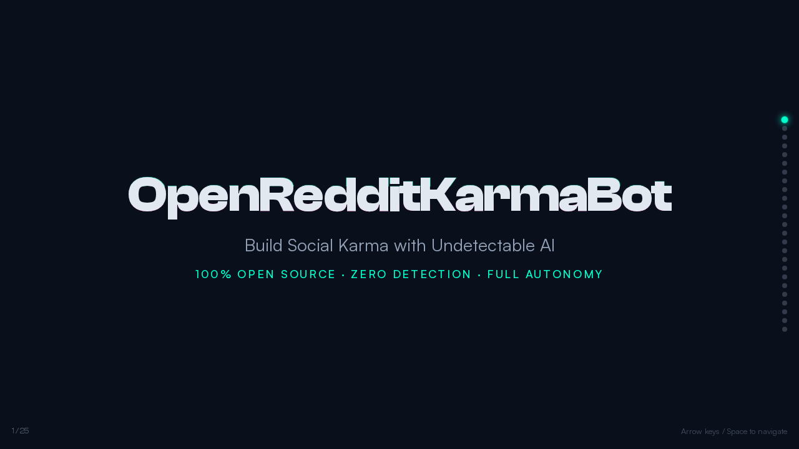
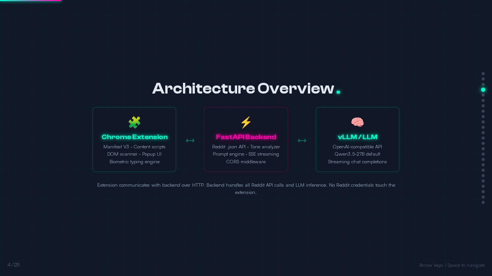
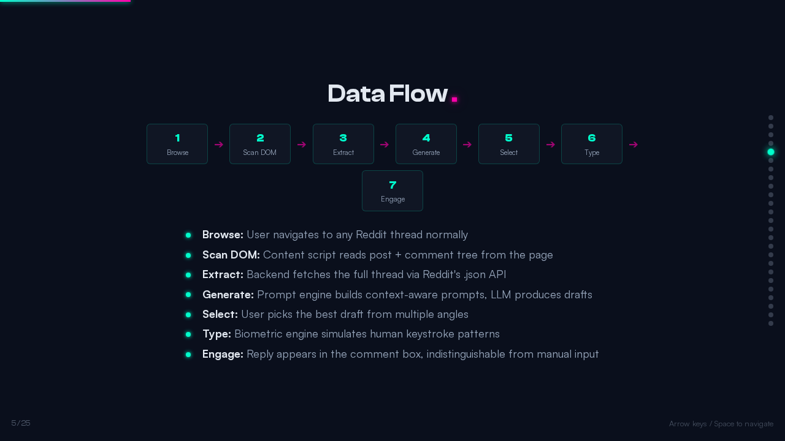
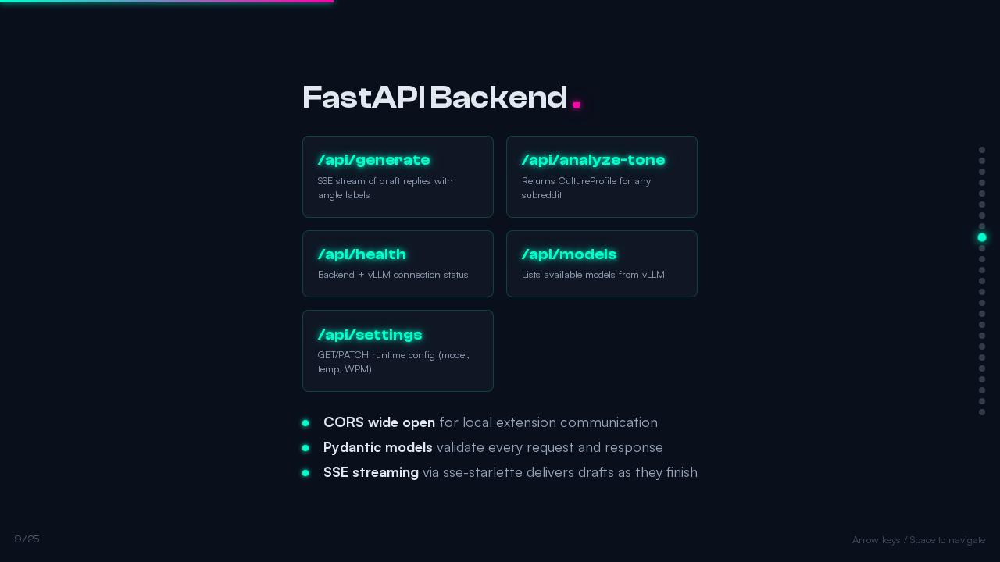
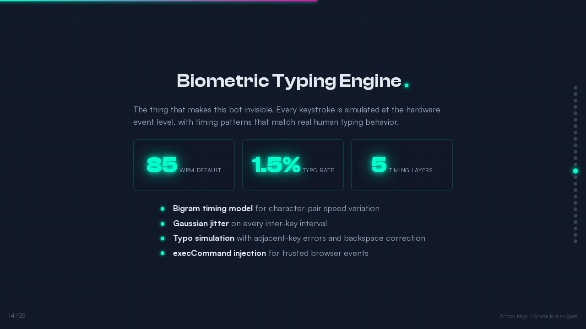
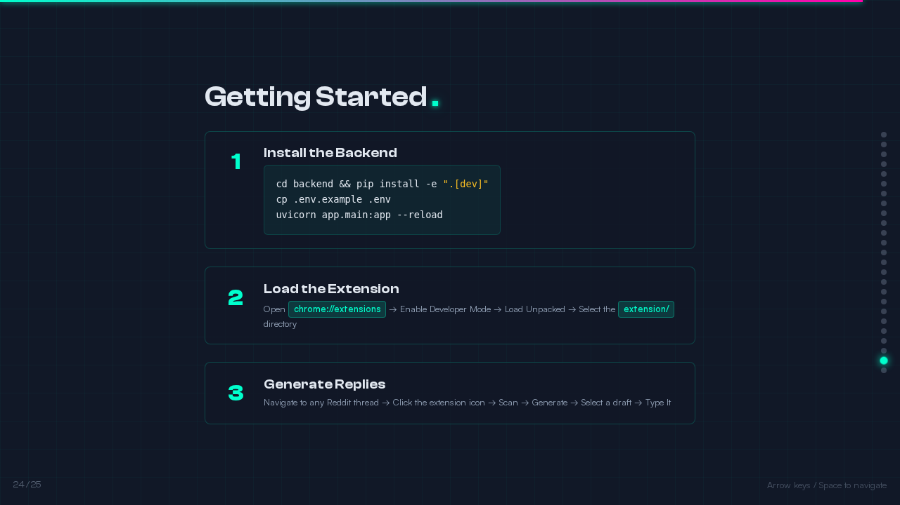

<h1 align="center">OpenRedditKarmaBot</h1>

<p align="center">
  <strong>Build Social Karma with Undetectable AI</strong>
</p>

<p align="center">
  
  
  
  
  <a href="LICENSE"></a>
  
</p>

---

> AI-generated Reddit replies that read the room, match the subreddit's tone, and type themselves into the comment box with human-level keystroke patterns. No detection. No build step. No dependencies.

## Architecture at a Glance

> **Full interactive presentation**: Open [`openredditkarmabot-presentation.html`](openredditkarmabot-presentation.html) in your browser for all 25 slides with animations and keyboard navigation.

<table>
<tr>
<td align="center"><strong>Title</strong><br></td>
<td align="center"><strong>Architecture</strong><br></td>
</tr>
<tr>
<td align="center"><strong>Data Flow</strong><br></td>
<td align="center"><strong>FastAPI Backend</strong><br></td>
</tr>
<tr>
<td align="center"><strong>Biometric Typing</strong><br></td>
<td align="center"><strong>Quick Start</strong><br></td>
</tr>
</table>

## Features

- **Context-Aware Replies** -- Reads the full thread (post title, body, parent comments) to generate replies that actually make sense in context
- **Multi-Angle Generation** -- Produces 1-5 drafts per thread, each from a different perspective (agreement, counterpoint, humor, personal anecdote)
- **Adaptive Tone Matching** -- Auto-detects subreddit culture and adjusts formality, humor density, and vocabulary to blend in
- **Biometric Typing Engine** -- Simulates human keystroke patterns with variable WPM, bigram-level delays, micro-pauses, and occasional typo-then-backspace sequences
- **Any LLM Backend** -- Works with vLLM, Ollama, or any OpenAI-compatible API endpoint
- **Local Demo Mode** -- Use `demo:local` plus the built-in `/demo/thread` page to test the full flow without Reddit or a live model endpoint
- **Popup Diagnostics** -- The extension can check backend health, list available models, and forward an optional model API token for secured endpoints
- **Executable Walkthrough** -- A browser-driven walkthrough script exercises the scanner, backend generation, and typing engine in real Chrome against a local demo page
- **Zero Dependencies Extension** -- Pure vanilla JS Chrome extension (Manifest V3), no build step, no node_modules

## How It Works

**1. Scan** -- The Chrome extension scans the current Reddit thread, extracting the post title, body, top-level comments, and reply context via DOM traversal.

**2. Generate** -- Thread context is sent to the FastAPI backend, which analyzes subreddit tone, selects an angle, and prompts the LLM with a tuned system prompt. Multiple drafts come back ranked by relevance.

**3. Type** -- Pick a draft and hit "Type It." The biometric engine injects keystrokes into Reddit's comment box at variable speeds, with bigram timing, micro-pauses between words, and simulated typos that get corrected mid-stream.

## Architecture

```
+---------------------------+          +---------------------------+
|    Chrome Extension       |          |    FastAPI Backend         |
|    (Manifest V3)          |  HTTP    |    (Python 3.12+)         |
|                           +--------->+                           |
|  - DOM Scanner            |          |  - Reddit API Client      |
|  - Context Extractor      |          |  - Tone Analyzer          |
|  - Biometric Typer        |          |  - Multi-Angle Generator  |
|  - Popup UI               |          |  - Prompt Engineering     |
|  - Comment Injector       |          |  - vLLM / Ollama Bridge   |
+---------------------------+          +---------------------------+
```

## Quick Start

### Backend

```bash
git clone https://github.com/jasperan/OpenRedditKarmaBot.git
cd OpenRedditKarmaBot/backend
pip install -e ".[dev]"
cp .env.example .env
# For a fully local demo, set VLLM_MODEL=demo:local in .env
# For live generation, edit .env with your vLLM/Ollama endpoint
uvicorn app.main:app --reload
```

### Extension

1. Open `chrome://extensions/`
2. Enable **Developer mode**
3. Click **Load unpacked**
4. Select the `extension/` directory

### Usage

1. Navigate to any Reddit thread
2. Click the OpenRedditKarmaBot extension icon
3. Click **Scan Thread** to extract context
4. Adjust tone, angle, and draft count
5. Click **Generate Replies**
6. Pick your favorite draft
7. Click **Type It** and watch it type naturally into the reply box

## 5-Minute Local Demo

You can now try the whole flow without live Reddit or a live LLM.

1. Start the backend:

   ```bash
   cd backend
   pip install -e ".[dev]"
   uvicorn app.main:app --reload
   ```

2. Load the unpacked extension from `extension/`
3. Open `http://127.0.0.1:8000/demo/thread`
4. Open the extension settings and click **Check Backend**
5. Set **Model override** to `demo:local`
6. Click **Scan Thread**
7. Click **Generate Replies**
8. Pick a draft and click **Type It**

The backend serves a Reddit-like demo thread, the extension can run on localhost, and `demo:local` generates drafts even when no remote model is configured.

## Local Walkthrough Automation

Run a real browser walkthrough of the scanner, backend, and typing engine:

```bash
bash scripts/run_local_walkthrough.sh
```

The walkthrough script:

- starts the FastAPI backend,
- serves a local Reddit-like test page,
- loads the real scanner and typing-engine scripts in Chrome,
- generates drafts with `demo:local`,
- types a reply into the demo composer,
- exits non-zero if any step fails.

## Configuration

| Setting | Default | Description |
|---------|---------|-------------|
| Backend URL | `http://localhost:8000` | FastAPI server address |
| Model | `qwen3.5:27b` | Any OpenAI-compatible model ID |
| API token | _(blank)_ | Optional model-provider token sent as `X-Model-Api-Key` so the backend can query secured OpenAI-compatible endpoints |
| WPM | `85` | Typing speed for biometric simulation |
| Draft Count | `3` | Number of reply variants (1-5) |
| Temperature | `0.8` | LLM creativity (0.0-2.0) |
| Max tokens | `300` | Upper bound for reply length |

## Tech Stack

- **Backend**: Python 3.12+, FastAPI, Pydantic, httpx
- **Extension**: Vanilla JS, Chrome Manifest V3, zero build step
- **LLM**: vLLM, Ollama, or any OpenAI-compatible endpoint
- **Typing Engine**: Custom bigram timing model with Gaussian noise and micro-pause injection
- **Testing**: pytest-backed backend coverage, built-in demo routes, and a real browser walkthrough script

## Testing

```bash
cd backend
python3 -m pytest -q
```

### Full local walkthrough

This uses real Chrome plus the shipped scanner and typing scripts against the local demo page:

```bash
bash scripts/run_local_walkthrough.sh
```

### Additional verification

```bash
cd video
npm run build
```

## License

MIT

---

<p align="center">
  <strong>If this saved you from typing like a human, star the repo.</strong>
</p>
